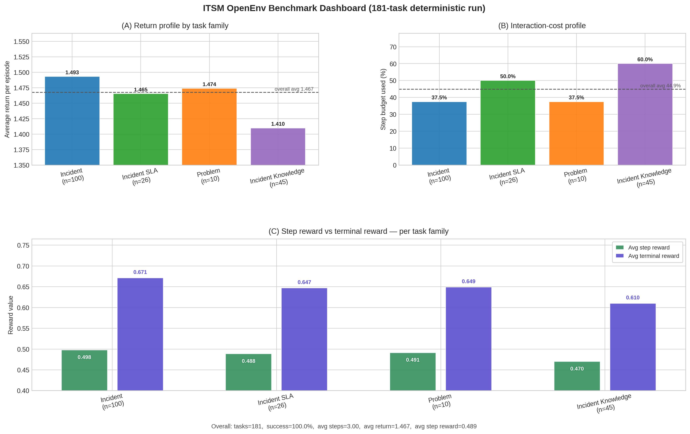
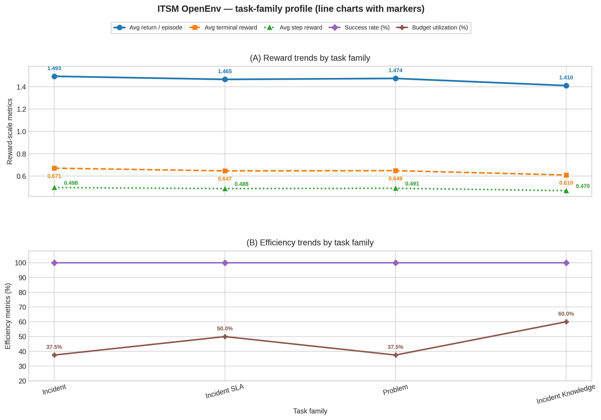

# ITSM OpenEnv Benchmark

[](https://www.python.org/)
[](https://fastapi.tiangolo.com/)
[](https://www.docker.com/)
[](tasks.jsonl)
[](openenv.yaml)

Deterministic enterprise benchmark for IT Service Management (ITSM) agents.  
The environment is designed for reproducible evaluation of multi-step operational workflows across incident handling, SLA updates, problem management, and incident-knowledge linking.

## Why This Repository

Most enterprise agent benchmarks suffer from hidden transitions, non-deterministic scoring, and weak alignment between objectives and backend state.

This repository addresses those gaps with:

- A canonical SQL seed and a fixed 181-task manifest.
- Deterministic transition and grading logic.
- Typed action/observation/reward contracts.
- End-to-end reproducibility from server start to metrics plots.

## Key Features

- 181 deterministic ITSM tasks.
- Four task families: incident, incident_sla, problem, incident_knowledge.
- Dense reward shaping with explicit components.
- Family-specific deterministic graders with bounded scores.
- OpenEnv-compatible HTTP surface: health, reset, step, state, web/docs.
- Baseline inference script with structured START/STEP/END logs.
- Reproducible analytics artifacts and dashboard generation.

## Benchmark Snapshot

| Metric | Value |
|---|---:|
| Total tasks | 181 |
| Success rate (baseline) | 100.0% |
| Avg steps per episode | 3.000 |
| Avg return per episode | 1.467 |
| Avg terminal reward | 0.651 |

Task-family composition:

| Family | Count |
|---|---:|
| incident | 100 |
| incident_sla | 26 |
| problem | 10 |
| incident_knowledge | 45 |

## Repository Structure

```text
.
├── itsm_openenv_benchmark/                # Canonical package
│   ├── models.py                          # Typed contracts
│   ├── client.py                          # OpenEnv client
│   ├── environment.py                     # Canonical environment export
│   └── env/
│       ├── core.py                        # Transition + reward logic
│       ├── loaders.py                     # Task/SQL loading
│       └── graders/                       # Deterministic family graders
├── server/
│   ├── app.py                             # FastAPI service
│   └── env/                               # Compatibility wrappers for legacy imports
├── itsm/dbs/                              # SQL seeds (canonical + historical snapshots)
├── assets/                                # Metrics artifacts
├── scripts/generate_metrics_plot.py       # Plot + summary generator
├── inference.py                           # Full benchmark inference runner
├── sample-inference.py                    # Single-task sample runner
├── tasks.jsonl                            # Canonical task manifest
├── openenv.yaml                           # Benchmark metadata
└── README.md
```

Design note: root-level compatibility modules are intentionally retained for OpenEnv deployment compatibility while canonical logic now lives under itsm_openenv_benchmark.

Architecture details: docs/architecture.md

## Installation

### Prerequisites

- Python 3.11+
- uv (recommended)
- Docker (optional)

### Option A: Local

```bash
uv venv
source .venv/bin/activate
uv pip install -r requirements.txt

# Optional: developer tooling (tests, lint, notebook extras)
uv pip install -e '.[dev]'
```

### Option B: Docker

```bash
docker build -t itsm-openenv -f server/Dockerfile .
docker run --rm -p 8000:8000 itsm-openenv
```

## Quickstart

Start the server locally:

```bash
uv run uvicorn server.app:app --host 0.0.0.0 --port 8000
```

Health check:

```bash
curl -s http://localhost:8000/health
```

Reset one task:

```bash
curl -s -X POST http://localhost:8000/reset \
  -H "Content-Type: application/json" \
  -d '{"task_id":"ITSM-001"}'
```

Take one step:

```bash
curl -s -X POST http://localhost:8000/step \
  -H "Content-Type: application/json" \
  -d '{"action_type":"query","target_id":"ITSM-001","payload":{}}'
```

## API Contract

### Endpoints

- GET /health
- POST /reset
- POST /step
- GET /state
- GET /web
- GET /docs

### Typed Models

- ITSMAction: action envelope with action_type, target_id, payload, reasoning.
- ITSMObservation: task metadata, snapshots, allowed actions, progress signals.
- ITSMReward: total reward + decomposed components.
- ITSMInfo: completion, grader score, violations, state delta.

The canonical types are defined in itsm_openenv_benchmark/models.py and exposed via compatibility modules for OpenEnv deployment paths.

## Running Baseline Inference

```bash
export ENV_BASE_URL=http://localhost:8000
export API_BASE_URL=https://router.huggingface.co/v1
export MODEL_NAME=Qwen/Qwen2.5-7B-Instruct
export HF_TOKEN=<your_hf_token>

uv run python inference.py
```

Expected protocol logs:

- [START] task=... env=... model=...
- [STEP] step=... action=... reward=... done=... error=...
- [END] success=... steps=... score=... rewards=...

## Reproducing Metrics

```bash
uv run python scripts/generate_metrics_plot.py \
  --tasks tasks.jsonl \
  --log full_run.log \
  --out assets/metrics.png \
  --line-out assets/metrics_line.png \
  --summary-out assets/metrics_summary.json
```

Generated artifacts:

- assets/metrics.png
- assets/metrics_line.png
- assets/metrics_summary.json

## Developer Workflow

Common commands via Makefile:

```bash
make install
make dev
make run
make test
make validate
make metrics
```

## Visual Results



Figure: multi-panel view of return profile, interaction cost, and reward composition by task family.



Figure: trend comparison across task families for reward and efficiency metrics.

## Determinism and Reproducibility

For strict reproducibility:

- Keep task ordering fixed.
- Keep canonical seed and task manifest unchanged.
- Keep grader logic unchanged across runs.
- Re-run inference and metrics with the same runtime configuration.

## Quality and Validation

Recommended checks:

```bash
openenv validate
bash pre-validation-script.sh <space_url>
pytest -q
```

The test suite includes a smoke test that validates reset/step behavior with typed actions.

## Notebook Workflow (Optional)

The notebook itsm_grpo_torchforge.ipynb provides an optional GRPO/QLoRA training workflow for policy fine-tuning and quick evaluation.

## References

- Meta PyTorch OpenEnv: https://github.com/meta-pytorch/OpenEnv
- Hugging Face OpenEnv Course: https://github.com/huggingface/openenv-course
- Meta PyTorch TorchForge: https://github.com/meta-pytorch/torchforge
- FastAPI docs: https://fastapi.tiangolo.com/
- Transformers: https://github.com/huggingface/transformers
- TRL: https://github.com/huggingface/trl
- PEFT: https://github.com/huggingface/peft
